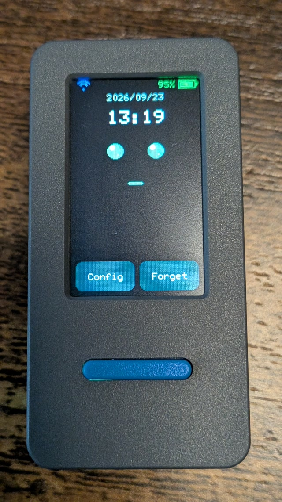
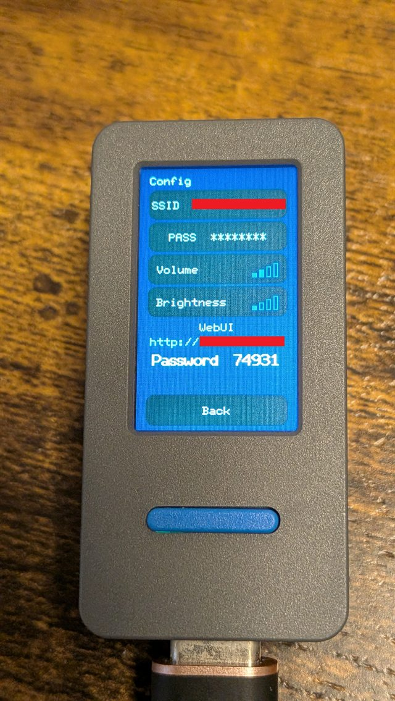
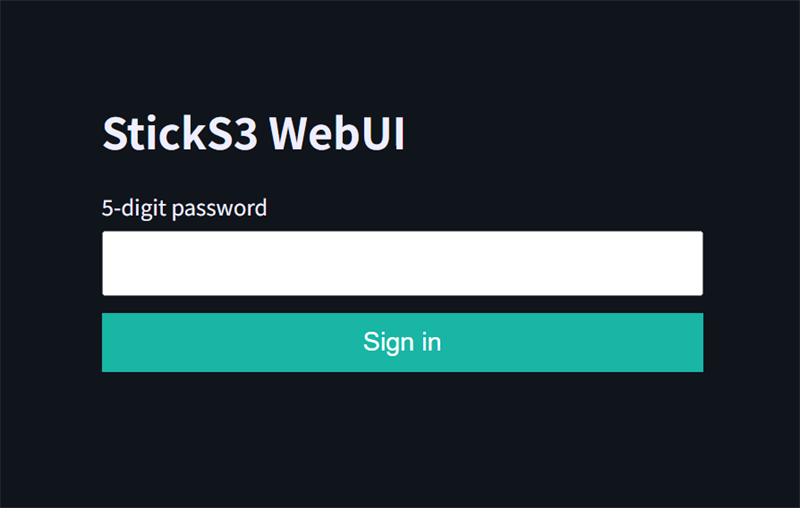
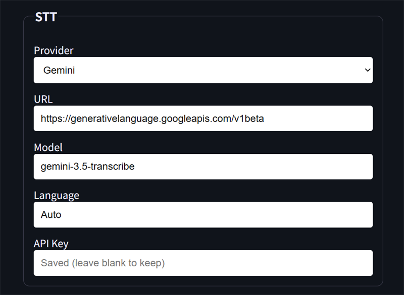
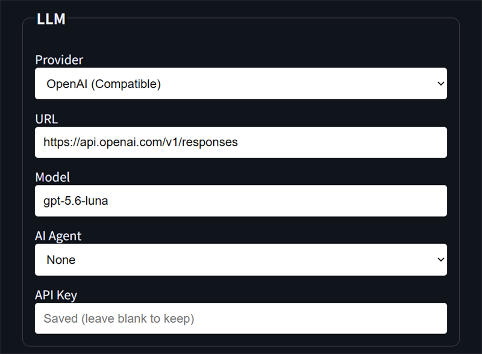
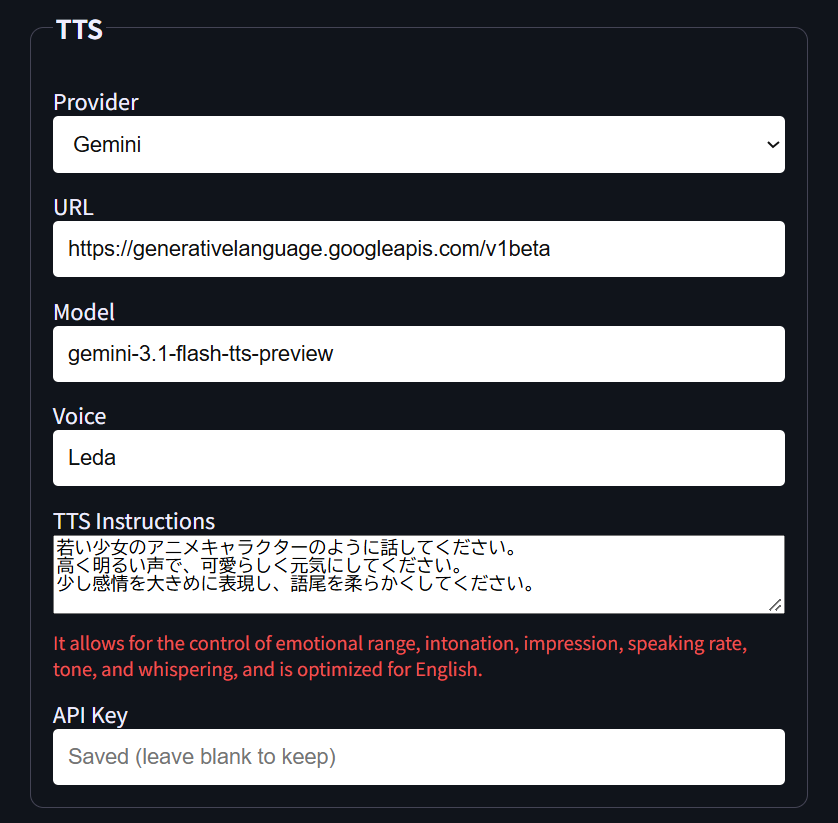
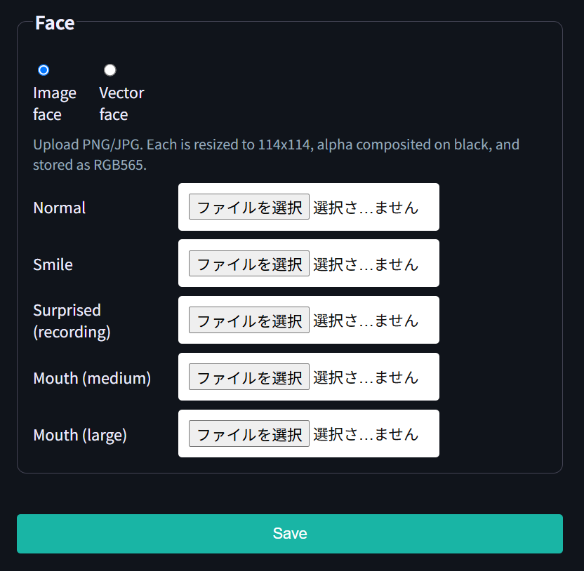

# StickS3Chat

[日本語](README.md) | [English](README_EN.md)

M5Stack StickS3（ESP32-S3）向けの音声会話チャットアプリです。ホーム画面でAボタンを押している間だけ録音し、設定したAIサービスで音声認識、応答生成、音声合成を行い、本体スピーカーから再生します。

このプロジェクトは **OpenAI Codexを使用して開発されました**。

<p align="center">
  
  
</p>

## 主な機能

- Push-to-Talk方式の音声録音（最大30秒、PSRAM使用）
- STT → LLM → TTSを個別に呼び出す `Separate APIs`
- 1つの独自APIで音声会話を処理する `Integrated API`
- OpenAI互換APIとGemini APIへの対応
- LLMでOpenAI Responses APIとChat Completions APIをURLから自動判定
- OpenClawとHermes Agentのセッションヘッダーに対応
- 音声再生中の字幕表示と口パク表示
- Wi-Fi、NTP、タイムゾーン、音量、画面輝度の設定
- 設定画面を開いている間だけ有効な、5桁パスワード認証付きWebUI
- 設定値をNVSへ保存
- 表情画像のアップロード（5種類、LittleFSにRGB565で保存）
- ベクトル顔と画像顔の切り替え
- TTS Instructions（音声スタイルの指示）
- 会話履歴を削除するForgetボタン（YES/NO確認付き）

## 必要な環境

- M5Stack StickS3
- ESP-IDF 5.4以降
- USB接続

依存ライブラリはESP-IDF Component Managerで取得します。M5Unifiedは `main/idf_component.yml` に定義されています。

## ビルドと転送

ESP-IDF環境を有効にしてから実行します。

```powershell
idf.py set-target esp32s3
idf.py build
idf.py -p COM8 flash
```

`COM8`はStickS3に割り当てられたCOMポートへ置き換えてください。

## 本体操作

| 画面・状態 | 操作 |
|---|---|
| ホーム・メニュー未選択 | Aボタンを押している間だけ録音し、離すと送信 |
| ホーム | Bボタンで `Config` / `Forget` を選択、Aボタンで決定 |
| Forget確認 | Bボタンで `YES` / `NO` を切り替え、Aボタンで決定（YESで履歴削除、NOでキャンセル） |
| Config | Bボタンで項目選択、Aボタンで決定 |
| 文字入力 | 左右の傾きで文字選択、前へ傾けて `OK`、後ろへ傾けて `DEL`、Aボタンで実行 |
| 音声再生中 | Aボタンで音声再生と字幕送りを停止し、録音待ちへ戻る |

## 初期設定

1. 本体で `Config` を開きます。
2. `SSID` と `PASS` を入力します。
3. Wi-Fi接続後、本体に表示されたWebUIのURLをブラウザで開きます。
4. 本体に表示された5桁の一時パスワードでログインします。
5. 日時と接続方式を設定して保存します。

<p align="center">
  
</p>

WebUIサーバーは本体のConfig画面を表示している間だけ動作します。サーバーを起動するたびに、新しい5桁パスワードが生成されます。

### 日時と接続方式

NTPサーバー、タイムゾーン、接続方式を設定します。`Separate APIs` と `Integrated API` の設定値はそれぞれ保持され、方式を切り替えても削除されません。

<p align="center">
  
</p>

## Separate APIs

録音した音声をSTTへ送り、認識結果をLLMへ、LLMの回答をTTSへ送ります。

```text
マイク録音 → STT → LLM → TTS → スピーカー再生
```

### OpenAI設定例

| 用途 | Provider | URL | Model | Voice |
|---|---|---|---|---|
| STT | OpenAI (Compatible) | `https://api.openai.com/v1/audio/transcriptions` | `gpt-4o-transcribe` | — |
| LLM | OpenAI (Compatible) | `https://api.openai.com/v1/responses` | `gpt-5.6-luna` | — |
| TTS | OpenAI (Compatible) | `https://api.openai.com/v1/audio/speech` | `gpt-4o-mini-tts` | `marin` |

- OpenAI公式APIを使う場合は、各ブロックのAPI KeyへOpenAI APIキーを設定します。
- API Keyが空の場合は `Authorization` ヘッダーを送らないため、認証不要のLAN内OpenAI互換サーバーにも接続できます。
- LLM URLが `/responses` で終わる場合はResponses API、`/chat/completions` で終わる場合はChat Completions APIとして処理します。
- STTのLanguageが `Auto` の場合は `language` を送信しません。`ja`や`en`などを選ぶと、その値を送信します。
- `AI Agent`でOpenClawまたはHermes Agentを選択すると、設定したSession IDをLLMリクエストだけに付与します。

OpenAIのAPI仕様は、[GPT-4o Transcribe](https://developers.openai.com/api/docs/models/gpt-4o-transcribe)、[Models](https://developers.openai.com/api/docs/models)、[Text to speech](https://developers.openai.com/api/docs/guides/text-to-speech)を参照してください。

### Gemini設定例

| 用途 | Provider | URL | Model | Voice |
|---|---|---|---|---|
| STT | Gemini | `https://generativelanguage.googleapis.com/v1beta` | `gemini-3.5-transcribe` | — |
| LLM | Gemini | `https://generativelanguage.googleapis.com/v1beta` | `gemini-3.5-flash-lite` | — |
| TTS | Gemini | `https://generativelanguage.googleapis.com/v1beta` | `gemini-3.1-flash-tts-preview` | 例: `Kore` |

- 各ブロックのAPI KeyへGemini APIキーを設定します。
- STTは録音データをFiles APIへアップロードして文字起こしします。
- STTのLanguageが `Auto` の場合は言語指定を省略します。日本語は `ja-JP`、英語は `en-US`として処理します。
- LLMはGeminiの `generateContent` を使用します。
- TTSはGeminiのストリーミング応答から24kHz・16bit・モノラルPCMを取り出して再生します。

GeminiのAPI仕様は、[Audio understanding](https://ai.google.dev/gemini-api/docs/audio)、[Gemini models](https://ai.google.dev/gemini-api/docs/models)、[Speech generation](https://ai.google.dev/gemini-api/docs/speech-generation)を参照してください。

### WebUIの各設定ブロック

<p align="center"></p>
<p align="center"></p>
<p align="center"></p>

保存済みAPI KeyはWebUIへ平文表示されません。API Key欄を空のまま保存すると、保存済みの値を維持します。

### Claude（Anthropic）

ClaudeはLLMのProviderとして実装されていますが、**未検証**です。STTとTTSでは選択できません。

## Integrated API

`Integrated API`では、録音した音声を1つの独自APIサーバーへ送り、サーバー側でSTT・LLM・TTSを一括処理します。このような独自APIサーバーと連携できます。

```text
マイク録音 → Integrated API → JSON + WAV → スピーカー再生
```

### リクエスト例

```bash
curl -X POST https://api.example.com/v1/voice-chat \
  -H "Authorization: Bearer YOUR_API_KEY" \
  -F "file=@recording.wav;type=audio/wav" \
  -F "correctTranscript=true" \
  -F "user=example-user" \
  -F "sessionKey=example-session" \
  -F "deviceId=sticks3-example" \
  -F "resetSession=false" \
  -F "voice=example-voice"
```

リクエストは `multipart/form-data` です。`file`だけが必須で、録音データは16kHz・16bit・モノラルPCMのWAVです。API Keyが空の場合は `Authorization` ヘッダーを送信しません。

| フィールド | 必須 | 説明 |
|---|---:|---|
| `file` | はい | 録音したWAVファイル |
| `correctTranscript` | いいえ | 認識結果を補正するか。既定値は `true` |
| `user` | いいえ | ユーザー識別子 |
| `sessionKey` | いいえ | 会話セッション識別子 |
| `deviceId` | いいえ | デバイス識別子 |
| `resetSession` | いいえ | 通常は `false` |
| `voice` | いいえ | サーバー側で使用する音声名 |

### レスポンス例

レスポンスは `multipart/mixed` とし、1番目のパートにJSON、2番目のパートにWAV音声を返します。

```http
HTTP/1.1 200 OK
Content-Type: multipart/mixed; boundary=voice-response

--voice-response
Content-Type: application/json; charset=utf-8

{"transcript":"こんにちは","answer":"こんにちは。何をお手伝いしましょうか？","sessionKey":"example-session"}
--voice-response
Content-Type: audio/wav
Content-Length: 123456

<WAV binary: 24 kHz, 16-bit PCM, stereo>
--voice-response--
```

WAVパートには正しい `Content-Length` が必要です。レスポンスで返された `sessionKey` は、次回以降のリクエストで再利用されます。

## 表情カスタマイズ

WebUIから表情画像をアップロードし、LCDに表示する顔を切り替えることができます。

### 表情の種類

| 表情 | 用途 |
|---|---|
| Normal | 通常時 |
| Smile | 待機中の笑顔 |
| Surprised | 録音中 |
| Mouth (medium) | 発話中（口・中） |
| Mouth (large) | 発話中（口・大） |

### アップロード方法

1. WebUIのFaceセクションで、各表情の画像ファイル（PNG/JPG）を選択します。
2. ブラウザ側で114x114にリサイズし、透過部分は黒背景に合成してからRGB565へ変換します。
3. 変換済みの25,992バイトの生データをESP32へ送信し、LittleFSに保存します。

ESP32側では画像のデコード・リサイズ・色変換を行わず、LittleFSからRGB565データを読み出してLCDへ描画するだけです。

<p align="center"></p>

### ベクトル顔と画像顔

Faceセクションで `Image face` / `Vector face` を切り替えます。`Vector face` を選択して保存すると、アップロードした画像ファイルは削除され、従来のベクトル描画に戻ります。

## TTS Instructions

TTSの音声スタイル（声質・話し方・演技など）をWebUIから指定できます。

- **OpenAI**: リクエストの `instructions` フィールドに送信します。
- **Gemini**: `DIRECTOR'S NOTES` としてテキストプロンプトに組み込みます。
- 空欄の場合は、従来のTTS動作を維持します。

Providerごとに既定値が設定されています。OpenAIは英語の指示、Geminiは日本語の指示が既定です。Providerを切り替えると、テキストエリアの内容も切り替わります。

## 設定データ

Wi-Fi認証情報、API URL、API Key、セッション情報、日時設定、音量、画面輝度は本体のNVSへ保存されます。リポジトリには、自宅内IPアドレス、個人用外部エンドポイント、Wi-Fi認証情報、API Key、セッションIDを含めていません。

## 開発

本アプリはOpenAI Codexとの共同作業により設計・実装・デバッグされました。
