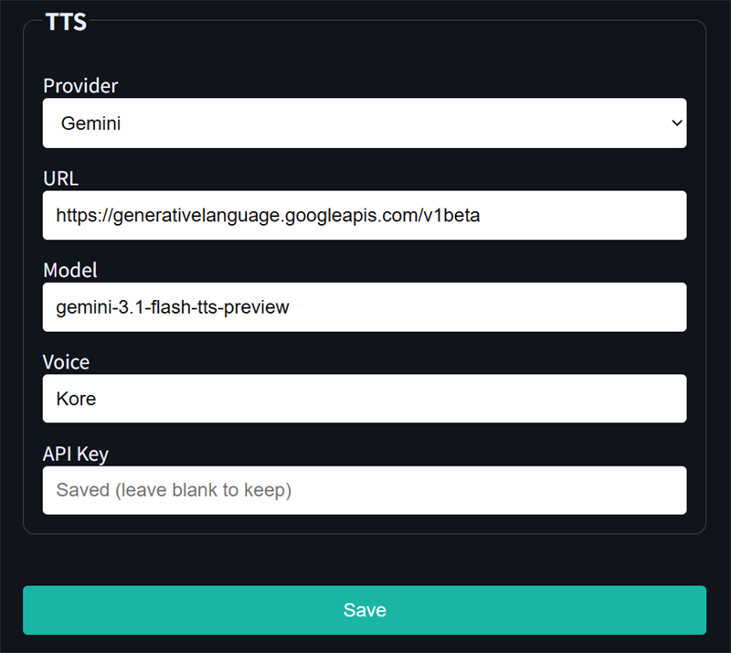

# StickS3Chat

[日本語](README.md) | [English](README_EN.md)

StickS3Chat is a voice conversation application for the M5Stack StickS3 (ESP32-S3). Hold the A button on the home screen to record, then the device sends the audio to configured AI services and plays the generated speech through its built-in speaker.

This project was **developed using OpenAI Codex**.

<p align="center">
  
  
</p>

## Features

- Push-to-talk recording for up to 30 seconds using PSRAM
- `Separate APIs` mode for independent STT, LLM, and TTS services
- `Integrated API` mode for a custom all-in-one voice API
- OpenAI-compatible and Gemini APIs
- Automatic OpenAI Responses API / Chat Completions detection from the LLM URL
- OpenClaw and Hermes Agent session headers
- On-screen response text and mouth animation during playback
- Wi-Fi, NTP, time zone, volume, and display brightness settings
- Temporary five-digit password-protected WebUI, active only on the Config screen
- Persistent settings in NVS

## Requirements

- M5Stack StickS3
- ESP-IDF 5.4 or later
- USB connection

Dependencies are resolved through the ESP-IDF Component Manager. M5Unified is declared in `main/idf_component.yml`.

## Build and flash

Activate ESP-IDF, then run:

```powershell
idf.py set-target esp32s3
idf.py build
idf.py -p COM8 flash
```

Replace `COM8` with the COM port assigned to your StickS3.

## Device controls

| Screen / state | Control |
|---|---|
| Home, no menu selected | Hold A to record; release A to send |
| Home | Press B to select `Config`; press A to open it |
| Config | Press B to move the selection; press A to activate it |
| Text input | Tilt left or right to select; tilt forward for `OK`; tilt backward for `DEL`; press A to activate |
| Audio playback | Press A to stop playback and text scrolling, then return to recording standby |

## Initial setup

1. Open `Config` on the device.
2. Enter `SSID` and `PASS`.
3. After Wi-Fi connects, open the WebUI URL shown on the device.
4. Sign in with the temporary five-digit password shown on the device.
5. Configure date/time and a connection mode, then save.

<p align="center"></p>

The WebUI server runs only while the Config screen is open. A new five-digit password is generated each time the server starts.

### Date, time, and connection mode

Configure the NTP server, time zone, and connection mode. Values for `Separate APIs` and `Integrated API` are retained independently when switching modes.

<p align="center"></p>

## Separate APIs

Recorded audio is sent to STT, the transcript to the LLM, and the LLM answer to TTS.

```text
Microphone → STT → LLM → TTS → Speaker
```

### OpenAI example

| Purpose | Provider | URL | Model | Voice |
|---|---|---|---|---|
| STT | OpenAI (Compatible) | `https://api.openai.com/v1/audio/transcriptions` | `gpt-4o-transcribe` | — |
| LLM | OpenAI (Compatible) | `https://api.openai.com/v1/responses` | `gpt-5.6-luna` | — |
| TTS | OpenAI (Compatible) | `https://api.openai.com/v1/audio/speech` | `gpt-4o-mini-tts` | `marin` |

- For official OpenAI APIs, enter an OpenAI API key in each block.
- When the API Key is empty, no `Authorization` header is sent, allowing unauthenticated OpenAI-compatible LAN servers.
- An LLM URL ending in `/responses` uses the Responses API; one ending in `/chat/completions` uses Chat Completions.
- STT omits `language` when Language is `Auto`; selecting `ja`, `en`, or another value sends it.
- Selecting OpenClaw or Hermes Agent under `AI Agent` adds the configured Session ID only to LLM requests.

See the OpenAI documentation for [GPT-4o Transcribe](https://developers.openai.com/api/docs/models/gpt-4o-transcribe), [Models](https://developers.openai.com/api/docs/models), and [Text to speech](https://developers.openai.com/api/docs/guides/text-to-speech).

### Gemini example

| Purpose | Provider | URL | Model | Voice |
|---|---|---|---|---|
| STT | Gemini | `https://generativelanguage.googleapis.com/v1beta` | `gemini-3.5-transcribe` | — |
| LLM | Gemini | `https://generativelanguage.googleapis.com/v1beta` | `gemini-3.5-flash-lite` | — |
| TTS | Gemini | `https://generativelanguage.googleapis.com/v1beta` | `gemini-3.1-flash-tts-preview` | Example: `Kore` |

- Enter a Gemini API key in each block.
- STT uploads recorded audio through the Files API before transcription.
- STT omits the language setting for `Auto`; Japanese is handled as `ja-JP` and English as `en-US`.
- LLM uses Gemini `generateContent`.
- TTS extracts and plays 24 kHz, 16-bit, mono PCM from Gemini's streaming response.

See the Gemini documentation for [Audio understanding](https://ai.google.dev/gemini-api/docs/audio), [Gemini models](https://ai.google.dev/gemini-api/docs/models), and [Speech generation](https://ai.google.dev/gemini-api/docs/speech-generation).

### WebUI service blocks

<p align="center"></p>
<p align="center"></p>
<p align="center"></p>

Saved API keys are never displayed as plaintext in the WebUI. Saving with an empty API Key field keeps the stored value.

### Claude (Anthropic)

Claude is implemented as an LLM provider but is **not verified**. It is not available for STT or TTS.

## Integrated API

In `Integrated API` mode, recorded audio is sent to one custom API server that performs STT, LLM, and TTS. StickS3Chat can integrate with a custom API server using the following contract.

```text
Microphone → Integrated API → JSON + WAV → Speaker
```

### Request example

```bash
curl -X POST https://api.example.com/v1/voice-chat \
  -H "Authorization: Bearer YOUR_API_KEY" \
  -F "file=@recording.wav;type=audio/wav" \
  -F "correctTranscript=true" \
  -F "user=example-user" \
  -F "sessionKey=example-session" \
  -F "deviceId=sticks3-example" \
  -F "resetSession=false" \
  -F "voice=example-voice"
```

The request uses `multipart/form-data`. Only `file` is required. Recorded audio is a 16 kHz, 16-bit, mono PCM WAV. When the API Key is empty, the `Authorization` header is omitted.

| Field | Required | Description |
|---|---:|---|
| `file` | Yes | Recorded WAV file |
| `correctTranscript` | No | Whether to correct the transcript; defaults to `true` |
| `user` | No | User identifier |
| `sessionKey` | No | Conversation session identifier |
| `deviceId` | No | Device identifier |
| `resetSession` | No | Normally `false` |
| `voice` | No | Voice name used by the server |

### Response example

Return `multipart/mixed` with JSON in the first part and WAV audio in the second part.

```http
HTTP/1.1 200 OK
Content-Type: multipart/mixed; boundary=voice-response

--voice-response
Content-Type: application/json; charset=utf-8

{"transcript":"Hello","answer":"Hello. How can I help?","sessionKey":"example-session"}
--voice-response
Content-Type: audio/wav
Content-Length: 123456

<WAV binary: 24 kHz, 16-bit PCM, stereo>
--voice-response--
```

The WAV part must include a correct `Content-Length`. The returned `sessionKey` is reused in subsequent requests.

## Stored configuration

Wi-Fi credentials, API URLs, API keys, session data, date/time settings, volume, and display brightness are stored in the device's NVS. This repository does not contain home network addresses, personal external endpoints, Wi-Fi credentials, API keys, or session IDs.

## Development

This application was designed, implemented, and debugged in collaboration with OpenAI Codex.
