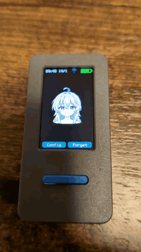
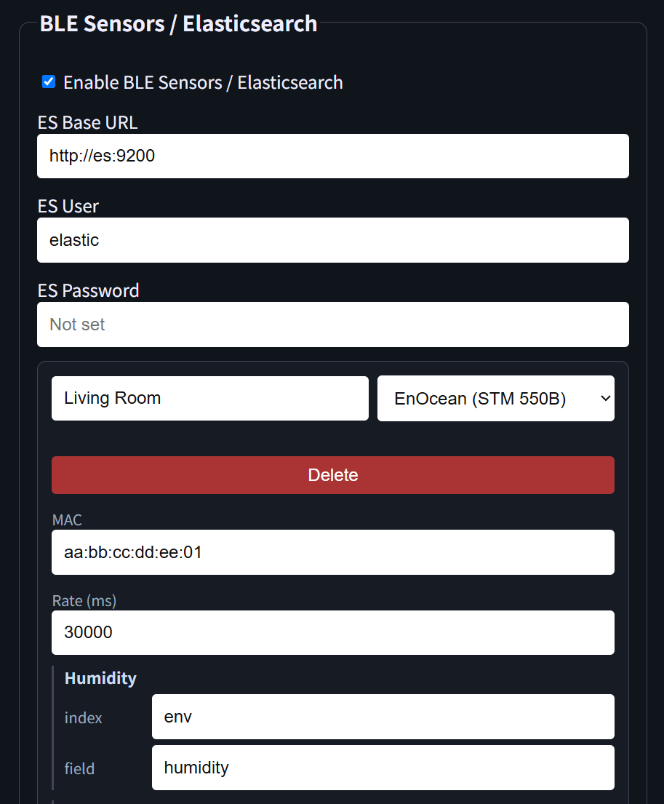
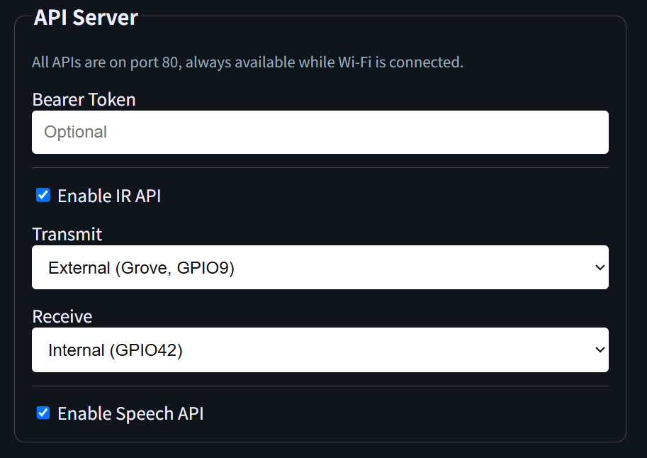
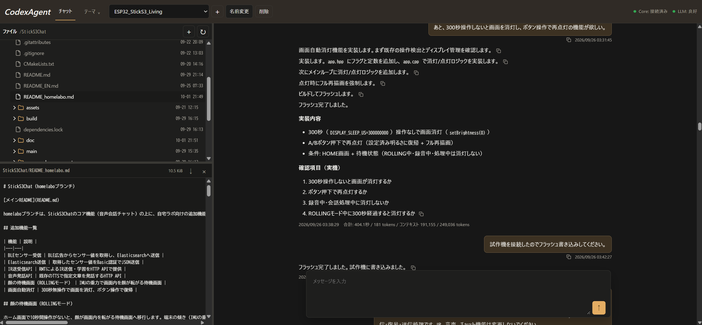

# StickS3Chat（homelaboブランチ）

[メインREADME](README.md)

homelaboブランチは、StickS3Chatのコア機能（音声会話チャット）の上に、自宅ラボ向けの追加機能を乗せたブランチです。コア機能（音声チャット・表情カスタマイズ・WebUI・設定）は[メインREADME](README.md)を参照してください。このドキュメントでは、homelaboブランチで追加された機能のみを説明します。

## 追加機能一覧

| 機能 | 説明 |
|---|---|
| BLEセンサー受信 | BLE広告からセンサー値を取得し、Elasticsearchへ送信 |
| Elasticsearch送信 | 取得したセンサー値をBasic認証でJSON送信 |
| IR送受信API | RMTによるIR送信・学習をHTTP APIで提供 |
| 音声発話API | 既存のTTSで指定文章を発話するHTTP API |
| 顔の待機画面（ROLLINGモード） | IMUの重力で画面内を顔が転がる待機画面 |
| 画面自動消灯 | 300秒無操作で画面を消灯、ボタン操作で復帰 |

## 顔の待機画面（ROLLINGモード）

ホーム画面で10秒間操作がないと、顔が画面内を転がる待機画面へ移行します。端末の傾き（IMUの重力ベクトル）を画面座標へ変換し、画面内の仮想的な箱の中で顔が現実の重力に従って転がる物理シミュレーションを行います。

<p align="center"></p>

### 動作

- 端末を傾けると、重力方向へ顔が加速・転がります。
- 端末を回転させると、画面内で「床」になる辺も変化し、上下左右どの辺でも同じ物理式で転がります。
- 45°など中間角度では、顔が角方向へ自然に移動します。
- 壁に接触すると軽く反発し、接線方向には摩擦が働きます。
- 端末を振ると、現在の支持面から離れる方向へ跳ねます（ゆっくり傾けただけでは発火しません）。
- 転がっている途中で、ときどき勢いよく追加回転（60°・350ms）が発生します。

### 表情

- 移動中（転がっている・跳ねている・追加回転中）: 驚き顔
- 完全停止: 笑顔

### 移動範囲

- 左右: 画面外へ15pxまで出られます（顔の一部が隠れます）
- 上下: 画面外には出ません（ステータスバー・下部ボタンを保護）

### 復帰

- Aボタン: 待機画面を終了し、通常サイズ・中央位置・回転0°へ戻してそのまま録音開始
- Bボタン: 待機画面を終了し、メニューへ復帰

## BLEセンサー / Elasticsearch

WebUIの「BLE Sensors / Elasticsearch」セクションで設定します。有効化すると、登録したMACアドレスのBLE広告を受信し、デコードした値をElasticsearchへ送信します。無効にするとBLE受信待機をしないため処理が軽くなり、発話への影響もなくなります。

<p align="center"></p>

### 全体設定

| 項目 | 説明 |
|---|---|
| Enable BLE Sensors / Elasticsearch | BLE受信とElasticsearch送信の全体有効/無効 |
| ES Base URL | ElasticsearchのベースURL（例: `http://es:9200`） |
| ES User / ES Password | Basic認証のユーザー名・パスワード |

### 機器種別

最大5台まで登録できます。機器種別に応じて必要な入力欄が表示されます。

| 種別 | 表示名 | 受信項目 | デコード元 |
|---|---|---|---|
| illuminance | Sizuku LUX | Illuminance | Manufacturer Specific Data |
| env | SwitchBot (SW3400010) | Humidity, Temperature | Manufacturer Specific Data |
| enocean | EnOcean (STM 550B) | Humidity, Temperature, Illuminance | Manufacturer Specific Data |
| xiaomi_s400 | Xiaomi S400 | 体重・体脂肪率 | 16-bit Service Data (UUID 0xFE95) |

### チャネル（index + field）

Sizuku LUX・SwitchBot・EnOceanは、受信項目ごとに独立した `index`（Elasticsearchの完全なインデックス名）と `field`（JSONドキュメントのキー名）を指定します。`index` と `field` は文字列を連結するのではなく、それぞれ完全名で指定します。

例:

| 項目 | index | field |
|---|---|---|
| Humidity | `env` | `humidity` |
| Temperature | `env` | `temperature` |
| Illuminance | `env` | `illuminance` |

### Xiaomi S400（体組成計）

S400はMiBeacon v4/v5の暗号化データをAES-128-CCM（4バイトタグ）で復号します。機器ごとに以下を設定します。

| 項目 | 説明 |
|---|---|
| index | 送信先インデックス（完全名） |
| Bindkey | 32桁の16進数（16バイト） |
| Height (cm) | 身長（体脂肪率計算用） |
| Birth date | 生年月日（年齢計算用、YYYY-MM-DD） |
| Fat offset | 体脂肪率の補正値 |

体重・低周波インピーダンス・高周波インピーダンスを同一機器について最大30秒間保持し、3値が揃ったときだけ計算・送信します。`mass > 0` のときは体重（`mass / 10` kg）と低周波インピーダンス、`mass == 0` のときは高周波インピーダンスを求めます。

### Elasticsearch送信形式

通常のセンサーは、取得項目ごとに以下の文書を `POST {ES Base URL}/{index}/_doc/` へ送信します（Basic認証）。

```json
{"date": "2025-01-01T12:00:00Z", "device": "aa:bb:cc:dd:ee:ff", "humidity": 45.5}
```

- `date`: 取得時刻（UTC、ISO 8601）
- `device`: 機器のMACアドレス
- 最後のキー: WebUIで設定した `field` 名と値

S400は、以下の文書を1文書にまとめて設定したインデックスへ送信します。

```json
{"date": "2025-01-01T12:00:00Z", "weight_kg": 65.3, "body_fat_percent": 18.2}
```

### 受信処理

- 登録MACアドレスに一致する広告のみを処理します。
- SwitchBot・EnOcean・Sizuku LUXは設定した送信間隔（Rate）で制限します。
- S400はMiBeaconのパケット番号で重複を除外します。
- 復号とHTTP送信は受信コールバック内で行わず、キューを介してバックグラウンドタスクで処理します。

## API Server

WebUIの「API Server」セクションで設定します。IR送受信APIと音声発話APIは、既存のWebUIが使うポート80のWebサーバー上で常時提供されます（設定画面を閉じていても利用可能）。認証には共通のBearerトークンを使います。

<p align="center"></p>

### 共通設定

| 項目 | 説明 |
|---|---|
| Bearer Token | IR APIと発話APIで共有する認証トークン |
| Enable IR API | IR送受信APIの有効/無効 |
| Transmit / Receive | 送信・受信それぞれに `Internal` / `External` を独立に選択 |
| Enable Speech API | 音声発話APIの有効/無効 |

GPIO割り当て（StickS3）:

| モード | 送信 GPIO | 受信 GPIO |
|---|---:|---:|
| Internal | 46 | 42 |
| External（Grove） | 9 | 10 |

### IR送信 API

`POST /ir/send`

```bash
curl -X POST http://<host>/ir/send \
  -H "Authorization: Bearer <token>" \
  -H "Content-Type: application/json" \
  -d '{"durations_us":[9000,4500,560,560,560,1680],"carrier_hz":38000,"repeat":1}'
```

| フィールド | 必須 | 説明 |
|---|---:|---|
| `durations_us` | はい | 点灯・消灯を交互に並べたマイクロ秒配列（2..1024値、各1..65535） |
| `carrier_hz` | いいえ | キャリア周波数（20000..60000、既定38000） |
| `repeat` | いいえ | 繰り返し回数（1..10、既定1） |

受付時に `202` を返します（送信完了を意味しません）。

| ステータス | 意味 |
|---|---|
| 202 | 受付（送信キューに投入） |
| 400 | 入力不正 |
| 401 | 認証失敗 |
| 429 | 送信キュー満杯 |

### IR学習 API

`POST /ir/learn`

```bash
curl -X POST http://<host>/ir/learn \
  -H "Authorization: Bearer <token>" \
  -H "Content-Type: application/json" \
  -d '{"timeout_ms":5000}'
```

学習開始時にスピーカーアンプを停止し、200ms待ってから受信を開始します。終了時は成功・タイムアウト・エラーのいずれでも元のアンプ状態に戻します。エアコンのような複数フレームの信号も、後続フレームまで取得できる受信終了判定です。

```json
{"carrier_hz":38000,"repeat":1,"durations_us":[9000,4500,560,560,560,1680]}
```

| ステータス | 意味 |
|---|---|
| 200 | 受信成功（RAW信号を `durations_us` で返す） |
| 400 | 入力不正 |
| 401 | 認証失敗 |
| 408 | 受信タイムアウト |
| 409 | 同時学習要求 |

注: 受光部ではキャリア周波数を測定できないため、返す `carrier_hz`（38000）は実測値ではありません。

### 音声発話 API

`POST /api/speak`

```bash
curl -X POST http://<host>/api/speak \
  -H "Authorization: Bearer <token>" \
  -H "Content-Type: application/json" \
  -d '{"text":"こんにちは。"}'
```

| フィールド | 必須 | 説明 |
|---|---:|---|
| `text` | はい | 読み上げる文章（1..1024バイト） |

既存の音声合成・再生処理を使い、音声認識やLLMへの質問は行いません。発話は既存の音声タスクで処理され、ボタン操作による会話や他の発話と音声が重ならないようにします。発話中は文章を画面に表示し、設定済みの音量で再生します。

| ステータス | 意味 |
|---|---|
| 202 | 受付（発話キューに投入。再生完了を意味しません） |
| 400 | 入力不正 |
| 401 | 認証失敗、または発話APIが無効 |
| 429 | 発話キュー満杯 |
| 503 | 発話機能を利用できない（音声未準備） |

## 画面自動消灯

ホーム画面で300秒間操作がないと画面を消灯します。AボタンまたはBボタンを押すと復帰します。復帰時の最初のボタン操作は復帰に消費され、録音開始などにはなりません。消灯中はIMU監視・再描画・バッテリー・日時更新などの不要な処理を停止します。

## 開発ツール

homelaboブランチの開発は、自作のCodex coreベースの開発エージェントを使用しています。

<p align="center"></p>

## 備考

- 追加機能はすべてhomelaboブランチに限定されています。コア機能の挙動は変更していません。
- TLS・画面バッファ・音声バッファ・BLEホストのメモリをPSRAMへ移動する最適化を含みます（内部RAMの節約）。
- 設定値（BLE機器・ES認証・APIトークン等）は本体のNVSへ保存されます。リポジトリには自宅内IP・認証情報・Bindkeyを含めていません。
